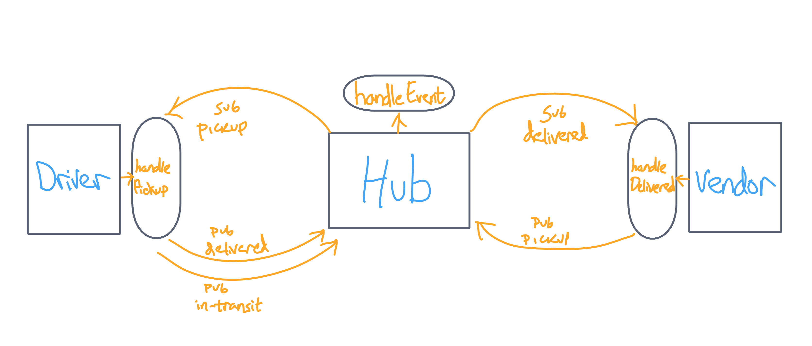
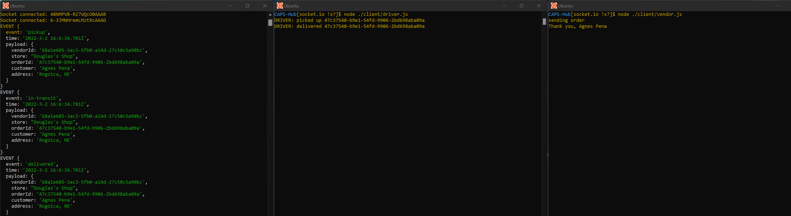

# CAPS-Hub

An event driven instant messaging system designed to facilitate messages between multiple vendor and driver clients in a delivery network.

Deployed Site: <Not Yet> 

Latest Pull Request: https://github.com/Micha-L-Davis/CAPS-Hub/pull/4

    
## Installation

1. Clone this repository onto your local machine
2. `cd` into `./CAPS-Hub`
3. Install package dependencies with `npm install`

## Author

Micha Davis

